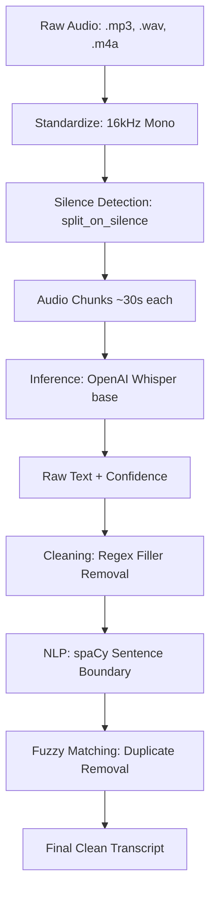

# Speech-to-Text (STT) Pipeline Description

This document explains how the **Audio2Notes AI** project converts raw lecture audio into clean, high-quality text for the AI to summarize.

---

## 🏗️ 1. Technical Flow Overview

The process is divided into three major stages: **Preprocessing**, **Inference**, and **Cleaning**.

---

## 🛠️ 2. Step-by-Step Breakdown

### Step 1: Preprocessing & Chunking
* **File**: `core/audio_processor.py`
* **Technologies**: `librosa`, `soundfile`, `pydub`
* **Why?**:
    * AI models (Whisper) are trained on specific sample rates. We convert all files to **16kHz Mono WAV** to ensure maximum accuracy.
    * Instead of processing a 1-hour file (which uses a lot of RAM), we detect moments of **silence** and split the audio into smaller chunks. We then merge those tiny chunks into roughly **30-second segments**.

### Step 2: AI Transcription (ASR)
* **File**: `core/transcriber.py`
* **Technology**: `openai-whisper` (Base Model)
* **Why?**:
    * Whisper is a state-of-the-art Automatic Speech Recognition (ASR) model.
    * We process the chunks **sequentially** (one-by-one) on your CPU. This ensures your computer doesn't crash while processing.
    * For every word the AI "hears," it assigns a confidence score. This helps us flag sections that might be blurry or hard to understand.

### Step 3: Text Cleaning & Refinement
* **File**: `core/transcriber.py`
* **Technologies**: `spaCy`, `rapidfuzz`, `re` (Regex)
* **Why?**:
    * **Filler Removal**: We use Regular Expressions to strip out words like "uh", "um", "basically", and "you know".
    * **Sentence Partitioning**: We use a `spaCy` NLP model (`en_core_web_sm`) to intelligently split the text into sentences (it knows the difference between a period in "U.S.A." and a period ending a sentence).
    * **De-Duplication**: A common AI glitch is "looping" (repeating the same sentence). We use **Fuzzy Matching** to compare every sentence; if a sentence is **85% similar** to the one before it, the duplicate is deleted.

---

## 🚀 3. Summary of Benefits
1. **Low Memory Usage**: Chunking ensures the server doesn't crash on long files.
2. **High Stability**: Sequential processing prevents CPU overload.
3. **Professional Quality**: Final notes are clean and free of spoken "clutter" (stuttering, fillers).
